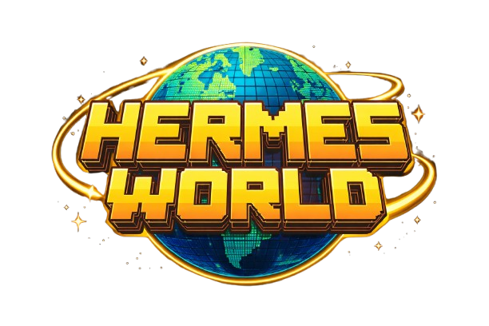

<p align="center">
  
</p>

# Hermes World

A universal agent simulation framework built on [Hermes Agent](https://github.com/NousResearch/hermes-agent) — Nous Research Hackathon submission.

> Describe any scenario in natural language. Hermes spawns a cast of agents — each a distinct human persona with a background, values, and skills. They reason each round, argue, learn new abilities, and mutate a shared world. The simulation runs on a cron heartbeat, delivers Telegram updates, and is visualised in a Three.js 3D world where characters physically move, group, and react in real time.

**The key insight:** this is a framework, not a single scenario. The same system can simulate a survival crisis, a startup founding team, a Mars colony, a village drought, or a jury deliberation — with agents, skills, and the 3D world adapting automatically to the context.

---

## Why it showcases Hermes uniquely

| Feature | How it's used |
|---|---|
| **Subagents** | Each agent in the simulation is a real Hermes subagent — isolated context, own reasoning loop, own tool access. They run in parallel each round. |
| **Cron heartbeat** | Rounds advance automatically on a cron schedule. The simulation runs overnight and is still going when you wake up. |
| **Skill creation** | Agents autonomously decide they need a capability, write a Hermes skill file for it, and use it in subsequent rounds. Skills persist and spread. |
| **Persistent memory** | Agents remember previous rounds — positions they held, arguments they heard, decisions made. Reasoning evolves across the full history. |
| **Telegram gateway** | Every round summary is delivered via the Hermes gateway. Reply to intervene mid-simulation — inject events, add agents, change conditions. |

---

## Quick start

**Prerequisites:** [Hermes Agent](https://github.com/NousResearch/hermes-agent) installed.

```bash
git clone https://github.com/junglejim506/hermes-world
cd hermes-world
bash install.sh
```

`install.sh` will:
- Check for Hermes installation
- Install Python dependencies
- Create `.env` from `.env.example` (edit to add your Telegram ID)
- Set up skill directories and symlinks
- Initialize `world_state.json`

Start the backend:

```bash
# Use Hermes venv Python (recommended)
~/.hermes/hermes-agent/venv/bin/python3 server.py

# Or system Python
python3 server.py
```

Start a simulation:

```bash
python3 orchestrator.py "10 people stranded on a raft. Supplies for 7. Storm lasts 3 days."
```

Open **http://localhost:8000** to watch the simulation live.

### Configuration

Copy `.env.example` to `.env` and edit:

```bash
cp .env.example .env
```

| Variable | Description |
|----------|-------------|
| `TELEGRAM_HOME_CHANNEL` | Your Telegram user/channel ID for round summaries |
| `ROUND_INTERVAL_MINUTES` | Minutes between rounds (default: 5) |
| `AGENT_DELAY_SECONDS` | Delay between agent API calls to avoid rate limits (default: 3) |

Telegram is optional — the simulation runs fine without it.

---

## Example scenarios

```bash
# Survival
python3 orchestrator.py "10 people stranded on a raft. Supplies for 7. Storm lasts 3 days."

# Startup
python3 orchestrator.py "A 5-person founding team with $50k runway and 3 competing product visions."

# Space colony
python3 orchestrator.py "A Mars colony crew of 6 dealing with a hull breach and dwindling oxygen."

# Village crisis
python3 orchestrator.py "A village of elders during a three-year drought. The well is running dry."

# Jury deliberation
python3 orchestrator.py "A jury of 8 deliberating a murder trial with contradictory evidence."
```

---

## CLI reference

```bash
# Start simulation (auto-registers cron, opens to --rounds immediate rounds)
python3 orchestrator.py "scenario" [--agents N] [--rounds N] [--interval MINUTES]

# Run one round manually
python3 orchestrator.py --tick

# Apply a natural-language intervention
python3 orchestrator.py --intervene "A rescue boat appears on the horizon"
python3 orchestrator.py --intervene "Reduce supplies by 30%"
python3 orchestrator.py --intervene "fast forward 2 rounds"

# Reset world state
python3 orchestrator.py --reset
```

---

## Telegram

Hermes World uses the Hermes gateway — no separate bot token needed. Start the gateway before running a simulation:

```bash
hermes gateway start
```

Every round, a summary is delivered to your Telegram. Reply to intervene:

- *"A storm hits — reduce morale by 20%"*
- *"Add a new agent — a grieving mother"*
- *"The rescue team arrives"*

---

## Architecture

```
hermes-world/
├── orchestrator.py       # Entry point — bootstrap, cron tick, intervention handler
├── round_runner.py       # Spawns parallel Hermes subagents, collects decisions, mutates world
├── persona_generator.py  # LLM call → N agent personas from scenario text
├── scene_classifier.py   # Scenario text → scene type (raft/office/village/space/courtroom)
├── skill_writer.py       # Writes SKILL.md files for agent-learned skills
├── telegram_reporter.py  # Formats and sends round summaries via Hermes gateway
├── server.py             # FastAPI + WebSocket — serves frontend, watches world_state.json
├── world_state.json      # Live simulation state
├── frontend/
│   ├── index.html        # HUD layout
│   ├── world.js          # Three.js engine — scene, characters, influence lines
│   ├── characters.js     # Low-poly humanoid builder + walk/speak/learn animations
│   ├── hud.js            # Sidebar — stances, stats, feed, skill registry, countdown
│   ├── ws-client.js      # WebSocket client with auto-reconnect
│   └── scenes/
│       ├── raft.js       # Ocean survival
│       ├── office.js     # Startup office
│       ├── village.js    # Village drought
│       ├── space.js      # Mars colony
│       └── courtroom.js  # Jury deliberation
└── skills/agents/        # Agent-learned skills written here at runtime
```

### How a round works

1. Cron fires → `orchestrator.py --tick`
2. One Hermes subagent spawned per agent in parallel
3. Each subagent receives: persona, world state, skill list, full history
4. Each returns a structured JSON decision: `speak / use_skill / learn_skill / idle`
5. If `learn_skill`: a real `SKILL.md` is written to `skills/agents/{agent_id}/`
6. World state mutations applied, influence graph updated, positions drift
7. `world_state.json` updated → WebSocket pushes diff to browser → characters move
8. Telegram round summary delivered

### World state schema

```json
{
  "scenario": "10 survivors on a raft...",
  "scene_type": "raft",
  "round": 3,
  "agents": [
    {
      "id": "elena_c",
      "name": "Elena C.",
      "role": "ER Doctor",
      "stance": "utilitarian",
      "skills": ["triage", "assess_risk"],
      "position": { "x": -2.8, "z": -1.0 },
      "last_action": { "type": "speak", "content": "Triage is the only ethical path." },
      "memory_summary": "Has argued for triage since round 1..."
    }
  ],
  "influence_graph": [{ "from": "elena_c", "to": "sofia_m", "strength": 0.6 }],
  "skill_registry": { "build_shelter": { "learned_by": "chen_w", "round": 2 } }
}
```

---

## Tech stack

- **[Hermes Agent](https://github.com/NousResearch/hermes-agent)** — subagents, cron, skills, memory, Telegram gateway
- **Python 3.9+** — orchestrator, round runner, FastAPI server
- **FastAPI + uvicorn** — WebSocket server, REST API
- **Three.js r128** — 3D world, characters, scene system
- **OpenRouter / Nous Portal** — LLM backend for subagents
